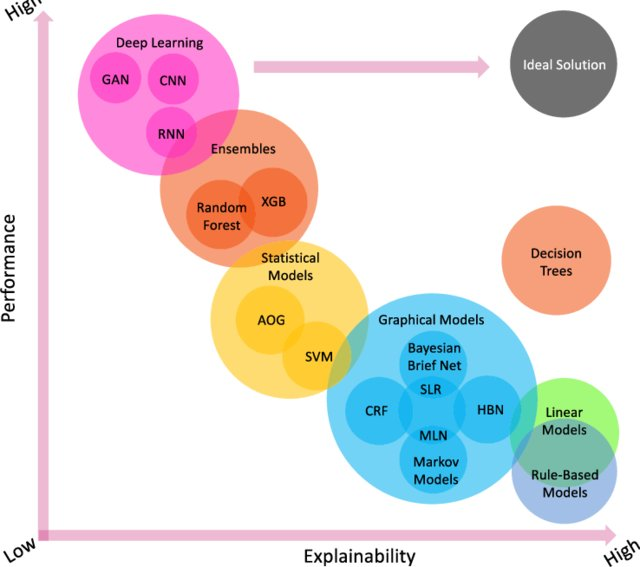

= Red{nbsp}Hat OpenShift Data Science

Red{nbsp}Hat OpenShift Data Science (RHODS) is a platform for data scientists, machine learning engineers, and operation teams to implement the full lifecycle of AI-based applications.

With RHODS, uses can gather data, use the data to train and evaluate their AI models, and serve and monitor those models.

Users can also create _Data Science Pipelines_ to implement and automate model workflows.

== What is Artificial Intelligence?

Artificial Intelligence is the area of computer science focused on solving tasks that usually require human intelligence.

One of the main approaches to building AI-based application is by using _machine learning_ techniques.
Machine learning techniques enable training computers to learn patterns from data to produce generalized responses.

AI/Machine learning can be divided into several subfields:

.Image from article: https://www.researchgate.net/publication/353621660_Unbox_the_black-box_for_the_medical_explainable_AI_via_multi-modal_and_multi-centre_data_fusion_A_mini-review_two_showcases_and_beyond[_Unbox the black-box for the medical explainable AI via multi-modal and multi-centre data fusion: A mini-review, two showcases and beyond_]

=== Deep Learning

_Deep Learning_ techniques have been the most prolific approaches in terms of perfomance in the last decade.
Deep learning techniques use large neural networks.
Deep learning-based solutions have proven to be impresively effective with:

* Entity detection
* Generation (image, sound, text)
* Non-structured data such as images, text, sound...

==== Downsides of Deep Learning

* Poor explainability.
These methods are based on neural networks, which are considered black box models.

* Data hungry and computationally expensive.
Deep learning methods require lots of memory, and matrix-based heavy computations (via GPUs usually).

=== Classic Learning Algorithms

Other foundational, classic tecniques are still relevant in use on many production systems, for well-known use cases, such as:

* Spam detection
* Numerical estimations and forecasts (e.g. churn rate prediction).
* Anomaly detection
* Classification problems

Some of these methods are linear and logistic regression, probabilistic learning (e.g Bayesian methods), decision trees, and support vector machines.

In general, classic algorithms work better with structured, tabular data.
They are often are faster and lighter than deep learning models in the training process.
They are better for explainability

=== Downsides of Classic ML

* Less performant than deep learning models
* Some models might not be suitable for non-structured data.

== The Value of RHODS

Many AI models do not go beyond the training stages because the teams that train these models lack the tools to deploy, deliver, and maintain AI-based systems in production.

Additionally, many AI practioners struggle with the myriad tools, libraries and versions to maintain during the development and maintenance of AI-based applications, not to mention the significant effort required to configure GPU support and drivers.

*RHODS bridges the math/data science - engineering gap and operationalizes AI projects.*

RHODS augments OpenShift with the common tools used in the AI ecosystem, including:

Jupyter notebooks::
Arguably the number one tool for data scientists.
Jupyter notebooks provide interactive/executable Python documents and shells on the browser.

Portable working environments::
Each environment is made available as a container image.
Users can create pods based on the specific container image that they need (e.g. Python 3.11).
RHODS provides many of these images but users can create custom ones.

GPU-ready environments::
RHODS provides environments that are preconfigured for CUDA and NVIDIA GPUs.

Cloud-first Model Serving::
RHODS ships with OpenVino, which allows users to serve their models right after tranining them, without having to develop specific APIs.

Data Science Pipelines::
Users can automate the workflow of data gathering, model training, evaluation, and release instead of performing these tasks manually

Model monitoring::
You can monitor the performance of AI models in production with Prometheus and Grafana dashboards.

